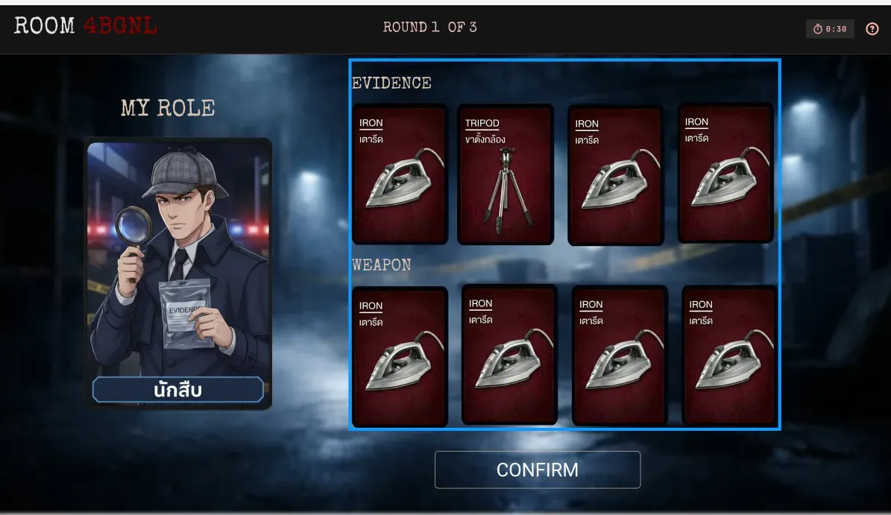
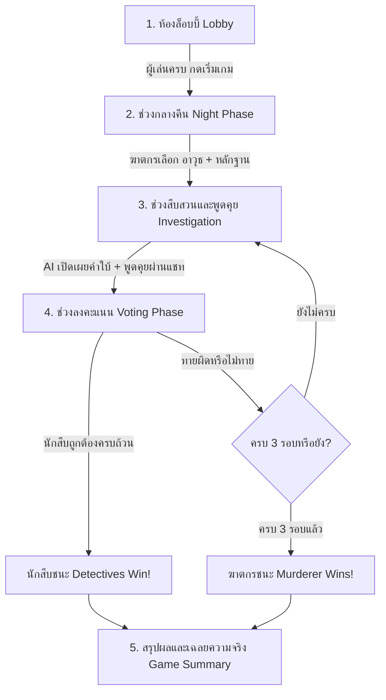

# 🔍 CSS FILES: Multiplayer Mystery & Deduction Web Game

<p align="center">
  
</p>

<p align="center">
  <strong>เกมสืบสวนคดีฆาตกรรมออนไลน์แบบผู้เล่นหลายคน (Real-time Multiplayer) บนเว็บเบราว์เซอร์</strong><br />
  ขับเคลื่อนด้วยระบบ <em>นักนิติวิทยาศาสตร์ AI</em> (Google Gemini) วิเคราะห์หลักฐานและให้คำใบ้แบบเรียลไทม์
</p>

<p align="center">
  
  
  
  
  
  
  
</p>

---

## 📑 สารบัญ (Table of Contents)
- [ภาพรวมของเกม (Game Overview)](#-ภาพรวมของเกม-game-overview)
- [บทบาทในเกม (Game Roles)](#-บทบาทในเกม-game-roles)
- [ขั้นตอนการเล่น (Game Phases)](#-ขั้นตอนการเล่น-game-phases)
- [ระบบนักนิติวิทยาศาสตร์ AI (AI Forensic Scientist)](#-ระบบนักนิติวิทยาศาสตร์-ai-ai-forensic-scientist)
- [ฟีเจอร์เด่นด้าน Mobile-First UX (Mobile Features)](#-ฟีเจอร์เด่นด้าน-mobile-first-ux-mobile-features)
- [สถาปัตยกรรมและเทคโนโลยี (Tech Stack)](#-สถาปัตยกรรมและเทคโนโลยี-tech-stack)
- [โครงสร้างโปรเจกต์ (Project Structure)](#-โครงสร้างโปรเจกต์-project-structure)
- [การติดตั้งและเริ่มใช้งาน (Getting Started)](#-การติดตั้งและเริ่มใช้งาน-getting-started)
- [การตั้งค่า Environment Variables](#-การตั้งค่า-environment-variables)
- [คำสั่งสคริปต์ (Available Scripts)](#-คำสั่งสคริปต์-available-scripts)

---

## 🕵️‍♂️ ภาพรวมของเกม (Game Overview)

**CSS FILES** เป็นเกมกระดานดิจิทัลแนวสืบสวนและอนุมานทางสังคม (Social Deduction & Mystery) ที่ได้รับแรงบันดาลใจจากบอร์ดเกมชื่อดังระดับโลก *Deception: Murder in Hong Kong* 

ในเกมนี้นักสืบทุกคนจะต้องร่วมมือกันไขคดีฆาตกรรมปริศนา แต่มีจุดหักมุมสำคัญคือ **ฆาตกรตัวจริงแฝงตัวอยู่ในหมู่นักสืบ!** และที่พิเศษยิ่งกว่าเดิมคือโปรเจกต์นี้มีระบบ **นักนิติวิทยาศาสตร์ AI** ที่ทำหน้าที่แทน Game Master คอยประเมินที่เกิดเหตุ วิเคราะห์ความเชื่อมโยงของอาวุธและหลักฐาน และสร้างคำใบ้ทางนิติวิทยาศาสตร์อย่างชาญฉลาดในทุก ๆ รอบ

- **จำนวนผู้เล่น**: 3 - 12 คน
- **เวลาต่อเกม**: 15 - 30 นาที
- **แพลตฟอร์ม**: ทำงานบนเว็บเบราว์เซอร์ 100% เล่นได้ทั้งบน PC, แท็บเล็ต และสมาร์ตโฟน (iOS / Android) โดยไม่ต้องดาวน์โหลดแอปพลิเคชัน

---

## 🎭 บทบาทในเกม (Game Roles)

| บทบาท | ฝ่าย | หน้าที่และเป้าหมาย |
| :--- | :---: | :--- |
| **🔪 ฆาตกร (The Murderer)** | ฝ่ายคนร้าย | ในช่วงกลางคืนต้องเลือก **อาวุธ (Means)** 1 อย่าง และ **หลักฐาน (Clues)** 1 อย่างจากหน้าไพ่ของตนเองอย่างลับ ๆ จากนั้นต้องร่วมสนทนาในฐานะนักสืบเพื่อเบี่ยงเบนความสนใจและไม่ให้ใครจับได้ |
| **🔎 นักสืบ (The Detectives)** | ฝ่ายสืบสวน | สังเกตการ์ดของผู้เล่นทุกคน วิเคราะห์คำใบ้จากนักนิติวิทยาศาสตร์ AI ถกเถียงและจับพิรุธ เพื่อชี้ตัวฆาตกร พร้อมระบุอาวุธและหลักฐานที่ถูกต้องให้ได้ก่อนหมดรอบ |
| **🤖 นักนิติวิทยาศาสตร์ AI (AI Forensic Scientist)** | ระบบ AI | AI ผู้รู้ความจริงทั้งหมด แต่ไม่สามารถพูดได้โดยตรง ทำหน้าที่ปล่อยคำใบ้เป็นรอบ ๆ (สาเหตุการเสียชีวิต, สถานที่เกิดเหตุ, และข้อสังเกตเฉพาะ) เพื่อชี้นำนักสืบไปสู่ความจริง |

---

## ⏱️ ขั้นตอนการเล่น (Game Phases)



1. **ห้องล็อบบี้ (Lobby & Invite)**:
   - ผู้สร้างห้อง (Host) กำหนดชื่อ และแชร์รหัสห้องหรือ QR Code ให้เพื่อนสแกนเข้าห้องได้ทันที
   - รองรับผู้เล่นสูงสุด 12 คน
2. **ช่วงกลางคืน (Night Phase: Crime Scene)**:
   - ฆาตกรจะได้รับการแจ้งเตือนสถานะ และต้องเลือกไพ่อาวุธ 1 ใบ + ไพ่หลักฐาน 1 ใบของตนเอง
   - ผู้เล่นอื่นจะอยู่ในสถานะ "กำลังรอฆาตกรก่อเหตุ..." พร้อมการ์ดของตนเอง
3. **ช่วงสืบสวนและพูดคุย (Investigation & Discussion Phase)**:
   - นักนิติวิทยาศาสตร์ AI ประมวลผลและเปิดเผยคำใบ้รอบใหม่
   - ผู้เล่นทุกคนพูดคุย วิเคราะห์ แลกเปลี่ยนข้อมูลผ่านระบบแชทในเกม
4. **ช่วงลงคะแนน (Voting Phase)**:
   - ผู้เล่นสามารถเลือกลงคะแนนเดาผู้ต้องสงสัย (เลือกผู้เล่น + อาวุธ + หลักฐาน)
   - หากทายถูกต้องครบทั้ง 3 อย่าง ฝ่ายนักสืบจะชนะทันที
   - หากผู้เล่นยังไม่มั่นใจ สามารถเลือกไม่ส่งผลโหวตเพื่อรอคำใบ้ในรอบถัดไปได้
5. **สรุปผลคดี (Game Summary)**:
   - แสดงผลผู้ชนะ เปิดเผยตัวตนของฆาตกร พร้อมเฉลยอาวุธและหลักฐานที่แท้จริง

---

## 🧠 ระบบนักนิติวิทยาศาสตร์ AI (AI Forensic Scientist)

โปรเจกต์นี้ผสานการทำงานร่วมกับ **Google Gemini API** (`@google/genai`) ในการสร้างบทบาทนักนิติวิทยาศาสตร์:
- **Context-Aware Clues**: AI จะรับรู้คู่ของ *อาวุธที่ใช้* และ *หลักฐานในที่เกิดเหตุ* จากนั้นสร้างคำใบ้ทางนิติวิทยาศาสตร์ที่สมจริงและสร้างสรรค์
- **Procedural Category Fallback**: หากไม่มี API Key หรือการเชื่อมต่อ AI ขัดข้อง ระบบมีชุดหมวดหมู่นิติวิทยาศาสตร์สำรอง (Analysis Decks) ทั้งภาษาไทยและภาษาอังกฤษที่คัดสรรมาอย่างสมบูรณ์ ทำให้เกมสามารถดำเนินต่อไปได้อย่างราบรื่น

---

## 📱 ฟีเจอร์เด่นด้าน Mobile-First UX (Mobile Features)

ระบบได้รับการออกแบบและปรับแต่ง Responsive สำหรับการเล่นบนสมาร์ตโฟนโดยเฉพาะ:

- **🔒 Orientation Guard**:
  - ล็อกหน้าจอให้อยู่ในโหมดแนวตั้ง (Portrait Lock) สำหรับมือถือ
  - หากผู้ใช้หมุนหน้าจอเป็นแนวนอน ระบบจะแสดงหน้าต่างเตือนให้หมุนโทรศัพท์กลับทันที
- **🎯 Thumb Zone Ergonomics (การจัดวางในระยะนิ้วโป้ง)**:
  - **มุมล่างซ้าย**: ปุ่มคำใบ้ลอย (Floating Clues FAB 🔍) พร้อมตัวนับ Badge จำนวนคำใบ้ แตะเปิดดูคำใบ้ทั้งหมดได้ทันที
  - **มุมล่างขวา**: ปุ่มแชทลอย (Floating Chat FAB 💬) พร้อมตัวนับข้อความที่ยังไม่ได้อ่าน
  - **ด้านล่างตรงกลาง**: แถบยืนยันการลงคะแนน (Vote Bar)
- **👆 Bi-directional Swipe Gestures (ปัดขึ้นหรือลงเพื่อปิด)**:
  - หน้าต่างคำใบ้ (`CluesModal`) และหน้าต่างแชท (`ChatBox`) รองรับการสัมผัสแบบลากตามนิ้วจริง (Real-time `translateY`)
  - ปัดนิ้วลงมากกว่า 60px หรือปัดนิ้วขึ้นมากกว่า 60px หรือสะบัดนิ้วเร็ว (Fling Velocity > 0.35 px/ms) เพื่อปิดหน้าต่างได้ทันที
  - มี Spring-back Animation เด้งกลับนุ่มนวลหากลากไม่ถึงเกณฑ์
- **🔔 Real-time Chat Notifications & Chime**:
  - เมื่อมีคนส่งข้อความในขณะที่ปิดหน้าต่างแชท จะมีแบนเนอร์แจ้งเตือนแบบ Slide Toast ด้านบน
  - มาพร้อมเสียงเตือนสังเคราะห์ (Web Audio API Synthesized Chime) ที่นุ่มนวล ไพเราะ ไม่รบกวน โดยไม่ต้องโหลดไฟล์เสียงภายนอก
- **🚫 Zero Overscroll**:
  - ล็อก Viewport ด้วย `height: 100dvh; overflow: hidden;` ป้องกันอาการขอบขาวและ Double Scrollbar 100%
- **🇹🇭 Thai Typography Overflow Protection**:
  - ใช้ `overflow-wrap: anywhere; word-break: break-word; hyphens: auto;` หมดปัญหาคำภาษาไทยที่ไม่มีการเว้นวรรคแล้วล้นออกนอกการ์ดหรือแผงข้อความ

---

## 🛠️ สถาปัตยกรรมและเทคโนโลยี (Tech Stack)

### Frontend (ไคลเอนต์)
- **Core**: [React 18](https://react.dev/) + [Vite 5](https://vitejs.dev/)
- **UI Framework**: [Material-UI (MUI v5)](https://mui.com/) + Emotion Styled Components
- **Routing**: [React Router v6](https://reactrouter.com/)
- **Real-time**: [Socket.IO Client](https://socket.io/docs/v4/client-api/)
- **Icons & Animation**: `@mui/icons-material`, `react-type-animation`
- **QR Code**: `qrcode.react` สำหรับสร้าง QR Code ห้องเล่นเกม

### Backend (เซิร์ฟเวอร์)
- **Runtime**: [Node.js](https://nodejs.org/) (ES Modules)
- **Framework**: [Express.js](https://expressjs.com/)
- **WebSockets**: [Socket.IO Server](https://socket.io/) สำหรับการซิงค์ Game State แบบ Two-way Communication
- **AI Service**: [@google/genai](https://www.npmjs.com/package/@google/genai) สำหรับเชื่อมต่อ Google Gemini API
- **Environment**: `dotenv`, `cors`

---

## 📁 โครงสร้างโปรเจกต์ (Project Structure)

```text
CSS_file/
├── index.html                      # Single Page HTML Entry Point
├── package.json                    # Frontend & Root Scripts
├── vite.config.js                  # Vite Build Configuration
│
├── server/                         # Backend Game Server
│   ├── index.js                    # Express + Socket.IO Server Setup
│   ├── gameLogic.js                # Game State Management & Gemini AI Logic
│   ├── package.json                # Server Dependencies
│   └── .env                        # Environment Variables (API Keys, Port)
│
├── src/
│   ├── assets/                     # รูปภาพ, อวาตาร์, วิดีโอแบ็กกราวด์, ฟอนต์
│   ├── api/
│   │   └── rules.js                # ฟังก์ชันสุ่มและคำนวณกฎของเกม
│   ├── components/                 # UI Components ทั้งหมด
│   │   ├── ChatBox.jsx             # แชทสืบสวน + Toast + Swipe Gestures
│   │   ├── CluesModal.jsx          # หน้าต่างคำใบ้ AI + FAB + Swipe Gestures
│   │   ├── ForensicSidebar.jsx     # แถบคำใบ้นิติวิทยาศาสตร์ (Desktop)
│   │   ├── GameCard.jsx            # การ์ดอาวุธ (Means) และหลักฐาน (Clues)
│   │   ├── GameHeader.jsx          # ส่วนหัวเกม (รหัสห้อง, รอบ, เวลา)
│   │   ├── GamePlayLayout.jsx      # เลย์เอาต์หลักระหว่างเล่นเกม
│   │   ├── GameSummary.jsx         # หน้าสรุปผลและเฉลยคดี
│   │   ├── Lobby.jsx / LobbyPlayers.jsx # ห้องรอล็อบบี้และรายชื่อผู้เล่น
│   │   ├── MurdererChoice.jsx      # หน้าจอเลือกอาวุธ/หลักฐานของฆาตกร
│   │   ├── OrientationGuard.jsx    # ตัวล็อกหน้าจอแนวตั้งบนมือถือ
│   │   ├── PhaseTimer.jsx          # ตัวนับเวลาถอยหลังในแต่ละรอบ
│   │   ├── PlayerPanel.jsx         # แผงการ์ดของผู้เล่นแต่ละคน
│   │   ├── VideoBG.jsx             # วิดีโอพื้นหลังแบบวนลูป
│   │   └── VoteBar.jsx             # แถบยืนยันการโหวตลงคะแนน
│   ├── data/                       # ฐานข้อมูลอาวุธ, หลักฐาน, คำใบ้ (ไทย & อังกฤษ)
│   │   ├── means-th.js / clues-th.js / analysis-th.js
│   │   └── means.js / clues.js / analysis.js
│   ├── store/
│   │   ├── GameContext.jsx         # React Context สำหรับเก็บ Game State
│   │   └── actions.js              # Socket Emitter Actions
│   ├── styles/
│   │   └── variables.css           # CSS Variables (Colors, Tokens, Shadows)
│   ├── views/                      # หน้าเพจหลัก
│   │   ├── Home.jsx                # หน้าแรก (Hero, วิธีเล่น, ปุ่มสร้าง/เข้าห้อง)
│   │   ├── Join.jsx                # หน้ากรอกรหัสห้องและชื่อเพื่อเข้าร่วม
│   │   ├── Game.jsx                # หน้ารวมฝั่ง Host
│   │   └── Player.jsx              # หน้ารวมฝั่ง Player
│   ├── App.jsx                     # Root App Component & Orientation Wrapper
│   ├── App.css                     # Global Styles & Typography
│   └── main.jsx                    # React Main Entry Point
```

---

## 🚀 การติดตั้งและเริ่มใช้งาน (Getting Started)

### ข้อกำหนดเบื้องต้น (Prerequisites)
- [Node.js](https://nodejs.org/) เวอร์ชัน 18.0.0 ขึ้นไป
- [npm](https://www.npmjs.com/) (มาพร้อมกับ Node.js)

### 1. Clone โปรเจกต์
```bash
git clone https://github.com/pattilwanida-oss/CSS_file.git
cd CSS_file
```

### 2. ติดตั้ง Dependencies
ติดตั้ง Dependencies ทั้งของ Frontend และ Backend:
```bash
# ติดตั้งฝั่ง Frontend (Root)
npm install

# ติดตั้งฝั่ง Backend (Server)
cd server
npm install
cd ..
```

---

## ⚙️ การตั้งค่า Environment Variables

สร้างไฟล์ `.env` ไว้ในโฟลเดอร์ `server/` เพื่อเปิดใช้งานฟังก์ชัน AI Forensic Scientist:

```bash
# server/.env
PORT=3001
GEMINI_API_KEY=your_google_gemini_api_key_here
```

> [!TIP]
> หากไม่มี `GEMINI_API_KEY` ตัวเกมจะยังคงทำงานได้อย่างสมบูรณ์ โดยจะสลับไปใช้ชุดคำใบ้มาตรฐานของบอร์ดเกม (Fallback Analysis Deck) โดยอัตโนมัติ

---

## 💻 คำสั่งสคริปต์ (Available Scripts)

### รันเพื่อพัฒนา (Development Mode)
รันทั้ง Frontend (Vite) และ Backend (Express + Socket.IO) พร้อมกันด้วยคำสั่งเดียว:
```bash
npm run dev
```
- **Frontend App**: [http://localhost:5173](http://localhost:5173)
- **Backend WebSocket Server**: [http://localhost:3001](http://localhost:3001)

### ตรวจสอบและ Build สำหรับ Production
```bash
npm run build
```
ไฟล์ Bundle ที่คอมไพล์แล้วจะถูกสร้างไว้ที่โฟลเดอร์ `dist/`

### พรีวิวผลลัพธ์ Production Build
```bash
npm run preview
```

---

## จัดทำโดย

นางสาวณิชาวีร์ อยู่พุ่มพฤกษ์
นางสาววนิดา วงศ์จำปา

---

## 📄 ใบอนุญาต (License)
โปรเจกต์นี้เผยแพร่ภายใต้ใบอนุญาต **MIT License**

---

<p align="center">
  สร้างขึ้นด้วยความหลงใหลในบอร์ดเกมและการสืบสวนคดีฆาตกรรม 🕵️‍♀️🔍<br />
  <strong>CSS FILES</strong> © 2026
</p>
